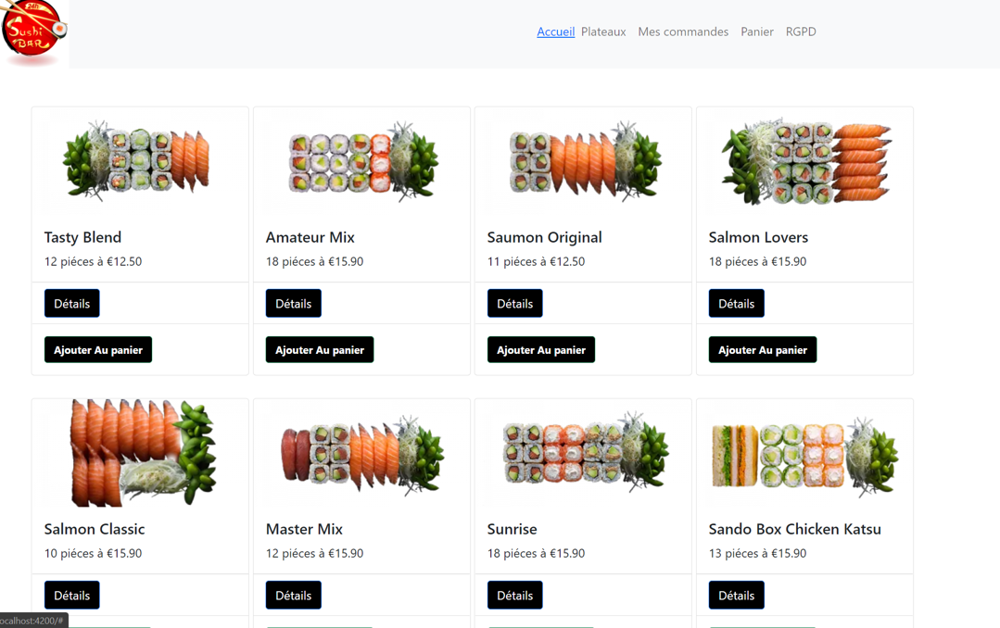
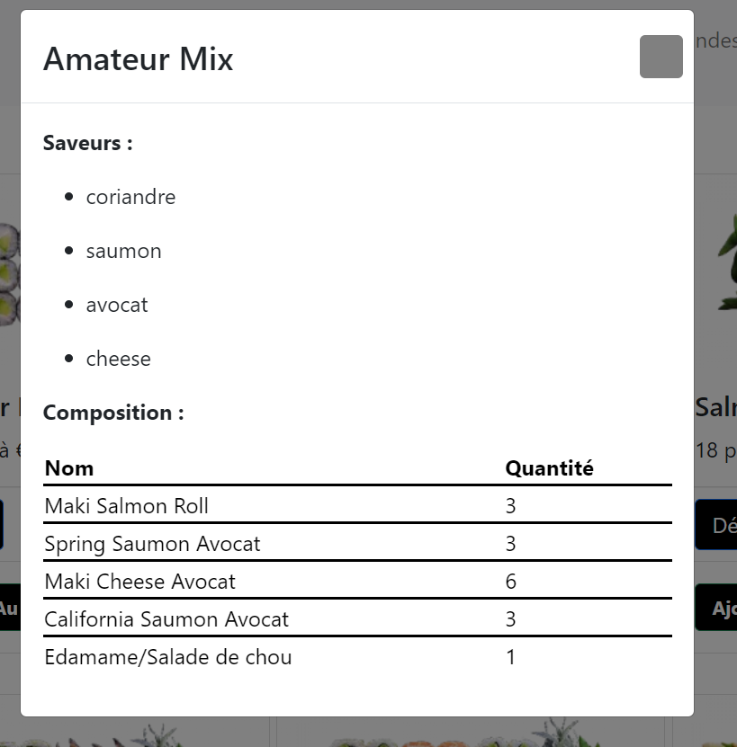
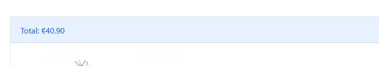
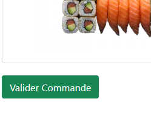
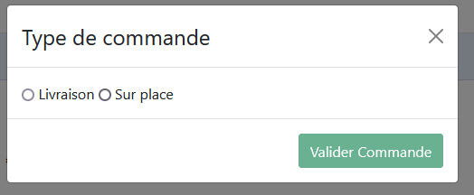
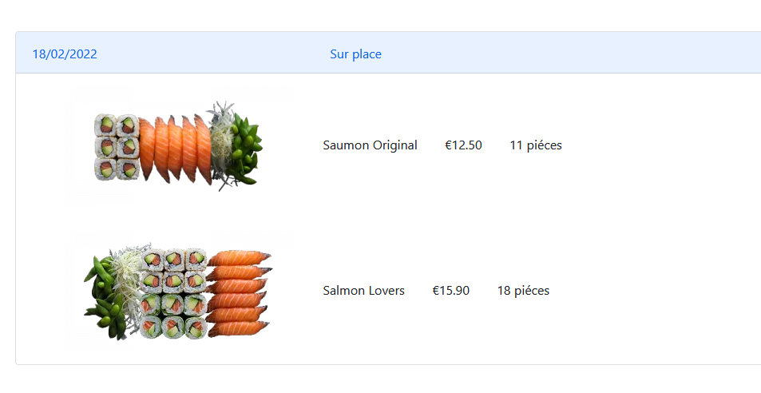
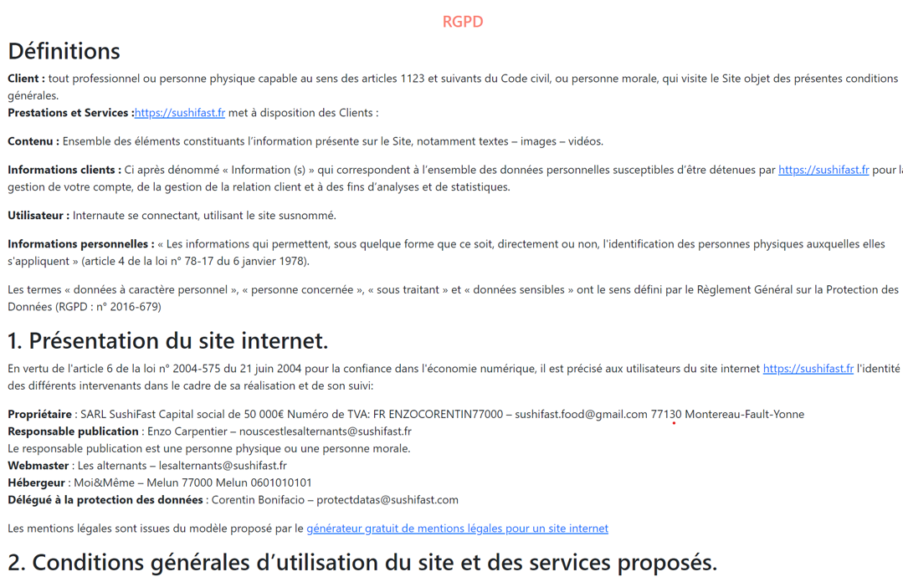

# SushiFast
Pour ce pojet nous devons crée une application web de vente de sushi ou deux scenario etait possible dans un premier temp: <br>
1. Si l’opérateur prend la commande par téléphone pour une livraison à domicile <br>
2. Ou le serveur prend une commande pour une consommation sur place.

# Les attendus fonctionnels demandées.
1. Dans un premier temp nous devons afficher la liste des plateaux de Sushi <br>
2. Pouvoir voir les details d'un plateau. <br>
3. L'achat d'un ou plusieurs plateaux sous forme d'un panier <br>
4. Visualiser les commandes sauvegardées localement <br>
5. Mise en place du RGPD <br> 

# Les attendus  techniques demandés: <br>
1. Interrogation d’une API existante via la saisie d’informations dans un formulaire, <br>
2. Définition d’une entité objet pour la représentation des données, <br>
3. Affichage de la liste des objets, accès au détail, calcul du montant de la commande, <br>
4. Sauvegarde locale côté client (LocalStorage), <br>
5. Prise en compte d’au moins 2 Evil User Stories (prévoir un tableau des actions redoutées) <br>
6. Test unitaire (au moins 3) - par exemple concernant la gestion d’une commande <br>

# Nos Boxes 
 ```
  getBoxes(): Observable<any> {
    // return this.http.get('http://localhost:3000/boxes');
    return this.http.get('assets/boxes.json');
  }
}
 ```
 ici nous recuperons nos boxes qui se situe dans notre api 

# La liste des plateaux



# Définitoin d'une entitée objet pour la répresentation des données.
```
export class Commande {

plateaux: Array<Plateau>;
    type: string;
    date: Date;
    constructor() {
        this.plateaux = new Array<Plateau>();
        this.date = new Date();
    }
}

```
```
export class Composition {
    nom: string;
    quantite: number;
}

```
```
export class Plateau{
    id: number;
    nom: string;
    pieces: number;
    composition: Array<Composition>;
    saveurs: Array<String>;
    prix: number;
    image: string;
    
    constructor() {
        this.saveurs = new Array<string>();
        this.composition = new Array<Composition>();
    }
}
```

voici nos 3 entitées pour la representation des données des Commandes , des plateaux et des Composition.

# Affichage de la liste des objets, accès au détail, calcul du montant de la commande

```
  calculTotal() {
    this.total= 0;
    for(let plateau of this.commande.plateaux) {
      this.total += plateau.prix;
    }
  }
```
 pour le calcul du montant total.
 
```
  showDetails(template: TemplateRef<any>, plateau: Plateau) {
    this.modalRef = this.modalService.show(template);
    this.plateauDetails = plateau;
  }

}
```
ceci va permettre d'afficher les details de la commande , dans c'est detaille vous toruverez la saveur ainsi que la composition. <br>



```
<div class="modal-body">
      <p style="font-weight: bold;">Saveurs : </p>
      <ul *ngFor="let saveur of plateauDetails.saveurs">
        <li>{{saveur}}</li>
      </ul>
```

```
 <p style="font-weight: bold;">Composition : </p>
      <table class="table table-success table-striped">
        <tr>
          <th>Nom</th>
          <th>Quantité</th>
        </tr>
        <tr *ngFor="let comp of plateauDetails.composition">
          <td>{{comp.nom}}</td>
          <td>{{comp.quantite}}</td>
        </tr>
```


# Sauvegarde locale côté client (LocalStorage)
```
validerCommande() {
    if (localStorage.getItem('commandes')) {
      this.commandes = JSON.parse(localStorage.getItem('commandes') || '{}')
    }
    this.commandes.push(this.commande);
    localStorage.setItem('commandes', JSON.stringify(this.commandes));
    localStorage.removeItem('commandeEncours');
    this.commande = new Commande();
    this.modalRef?.hide();
  }
  
```




```
 localStorage.setItem('commandes', JSON.stringify(this.commandes));
```
le setitem va permettre de stocker les donnée 
```
localStorage.getItem('commandes')
 
```
le  getItem() permet de recuperer les donnée 

```
 localStorage.removeItem('commandeEncours');
 
```
ici le remove va permet de supprimer la donnée commandeEncours


# Visualisation des plateaux commander



# RGPD



# Evil User Storie 

[Evil_User_Storie.pdf](https://github.com/hakim9100/Sushi-Main/files/8100712/Evil_User_Storie.pdf)

# Conclusion 

Pour conclure ce projet nous a permis d'apprendre d'avantage sur le framework Angular. Nous n'avons malhueresmentpas eut le temps d'effectuer les tests unitaires.
